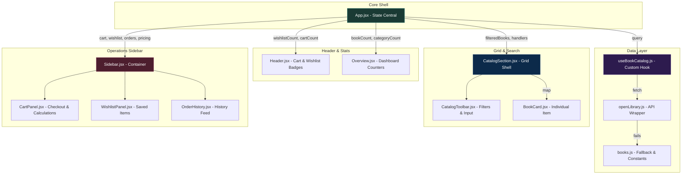

# 📚 Digital Bookstore: Feature & Architecture Documentation

Welcome to the technical documentation of the **Campus Reads** Digital Bookstore application. This document details the implementation of all 8 primary features shown in the project schema, showing **where** they are located in the codebase, **how** they are built under the hood, and **alternative industry-standard methods** to implement them.

---

## 🏗️ System & Component Architecture

Below is a visual representation of how components interact and share state within the e-commerce bookstore shell:



---

## 🔍 Feature Deep-Dive

### 1. Dynamic Product Display
*An elegant, grid-based presentation of live books mapped with rich metadata, covers, fallback states, and student pricing.*

* **Where it is made**:
  * **API Fetching**: [openLibrary.js](file:///Users/vishalpandey/Desktop/React/Project/React-project/src/api/openLibrary.js) (lines 63-80) uses the `searchBooks` function to query the Open Library API.
  * **Data Normalization**: [openLibrary.js](file:///Users/vishalpandey/Desktop/React/Project/React-project/src/api/openLibrary.js#L31-L61) inside `normalizeBook` formats API results into a consistent React data structure.
  * **Lifecycle Hook**: [useBookCatalog.js](file:///Users/vishalpandey/Desktop/React/Project/React-project/src/hooks/useBookCatalog.js) manages async lifecycle states (`books`, `loading`, `error`).
  * **Grid Presentation**: [CatalogSection.jsx](file:///Users/vishalpandey/Desktop/React/Project/React-project/src/components/CatalogSection.jsx#L61-L71) renders the items in a responsive CSS Grid.
  * **Individual Card**: [BookCard.jsx](file:///Users/vishalpandey/Desktop/React/Project/React-project/src/components/BookCard.jsx) displays details including dynamic cover SVGs, tags, ratings, and pricing.

* **How it is made**:
  1. **Asynchronous Querying**: A React `useEffect` inside `useBookCatalog.js` fires whenever the search query updates. It initiates an HTTP request to `https://openlibrary.org/search.json`.
  2. **Abort & Debounce**: An `AbortController` signal is passed to the `fetch` request. If the query changes before the request resolves, the active fetch is cancelled to prevent race conditions.
  3. **Resilience & Fallback**: If the fetch fails (e.g., due to network issues or API rate limits), the exception is caught, and a local list of fallback books ([books.js](file:///Users/vishalpandey/Desktop/React/Project/React-project/src/constants/books.js#L97-L126)) is loaded while showing a temporary notice.
  4. **Dynamic Cover Generation**: To bypass missing covers in the external API, `createBookCover` compiles a dynamic, visually stunning SVG cover using the book title and author, styled using one of six curated color palettes, converted to a data URI.

* **Alternative Methods**:
  * **Server-Side Rendering (SSR)**: Implementing with frameworks like **Next.js** or **Remix** where books are fetched on the server side. This yields faster initial page load times and boosts SEO indexes dramatically.


---

### 2. Search Functionality
*Instant, responsive searching across the live book catalog by typing keywords, titles, or authors.*

* **Where it is made**:
  * **State Control**: [App.jsx](file:///Users/vishalpandey/Desktop/React/Project/React-project/src/App.jsx#L11) declares the query state: `const [query, setQuery] = useState('');`.
  * **UI Input**: [CatalogToolbar.jsx](file:///Users/vishalpandey/Desktop/React/Project/React-project/src/components/CatalogToolbar.jsx#L17-L24) controls the input bar.
  * **Query Trigger**: [useBookCatalog.js](file:///Users/vishalpandey/Desktop/React/Project/React-project/src/hooks/useBookCatalog.js#L10-L33) triggers the side-effect fetch loop.

* **How it is made**:
  1. The user types into the text field in `CatalogToolbar`. This invokes `onQueryChange`, updating `query` in `App.jsx`.
  2. The updated query is passed down to `useBookCatalog(query)`.
  3. Inside the hook's `useEffect`, a `window.setTimeout` delay of **350ms (debounce)** is set up. This delays sending API requests until the student finishes typing, preventing unnecessary API throttling.
  4. If the user continues typing, the previous hook cleanup runs, canceling the active timeout and aborting the unfinished fetch request via `controller.abort()`.

* **Alternative Methods**:
  * **Client-side Fuzzy Match Search**: For smaller local datasets, we can load all items into memory once and perform immediate client-side fuzzy searching using libraries like **Fuse.js**. This is instant and doesn't require further network requests.
  * **Full-text Search Backend Index**: For large collections, utilizing a search engine like **Algolia**, **Meilisearch**, or **Elasticsearch** provides advanced capabilities like typo-tolerance, synonyms, and complex faceting out of the box.

---

### 3. Shopping Cart with Pricing
*An interactive cart management panel with detailed calculations for student discounts, free-shipping thresholds, and Indian Rupee (INR) formatting.*

* **Where it is made**:
  * **State Management**: [App.jsx](file:///Users/vishalpandey/Desktop/React/Project/React-project/src/App.jsx#L15) holds the cart array state.
  * **Business Rules & Calculations**: [App.jsx](file:///Users/vishalpandey/Desktop/React/Project/React-project/src/App.jsx#L41-L52) hosts the memoized pricing calculations.
  * **Quantity Operations**: [App.jsx](file:///Users/vishalpandey/Desktop/React/Project/React-project/src/App.jsx#L54-L72) provides add-to-cart and increment/decrement methods.
  * **Rendering Panel**: [CartPanel.jsx](file:///Users/vishalpandey/Desktop/React/Project/React-project/src/components/CartPanel.jsx) displays item details, quantity buttons, price breakdowns, and the Checkout button.

* **How it is made**:
  1. **Cart Item Structure**: Items are stored as an array of objects: `{ id: String, book: Object, quantity: Number }`.
  2. **Addition Logic**: `addToCart` checks if the book is already present. If found, it increments `quantity` by 1. If not, it appends a new item with `quantity: 1`.
  3. **Updating and Removing**: `updateQuantity` takes the item ID and a delta (+1 or -1). It maps through the items, modifies the target quantity, and immediately filters out any item whose quantity falls to `0`.
  4. **Pricing Engine (`useMemo` calculations)**:
     * **Subtotal**: Aggregates prices using `cart.reduce((sum, item) => sum + item.book.price * item.quantity, 0)`.
     * **Student Discount**: Applies a dynamic **10% discount** off the subtotal.
     * **Shipping**: Standard shipping is ₹79. If subtotal is greater than the `FREE_SHIPPING_THRESHOLD` (₹2500) or if the cart is empty, shipping becomes **₹0 (Free)**.
     * **Total**: Subtotal - Discount + Shipping.
  5. **Indian Rupee (INR) Formatting**: [currency.js](file:///Users/vishalpandey/Desktop/React/Project/React-project/src/utils/currency.js) creates a native `Intl.NumberFormat` instance using `en-IN` local configurations for beautiful currency notation (e.g., `₹2,499`).

* **Alternative Methods**:
  * **Persisted Store Hook**: Wrap the cart state in a hook that automatically syncs the cart array to `localStorage` or `sessionStorage`. This prevents the cart from clearing on page reloads.
  * **Context / Redux State**: As the app expands, pass the cart state via a React Context Provider or a Redux Toolkit slice. This allows nested components (like a modal, badge, or separate product pages) to read/write cart states without passing props.

---

### 4. Order Summary & History
*Tracking and listing finalized transactions, calculating total item volumes, assigning order IDs, and displaying order statuses.*

* **Where it is made**:
  * **State Initialization**: [App.jsx](file:///Users/vishalpandey/Desktop/React/Project/React-project/src/App.jsx#L17) initializes past orders state with static data from constants.
  * **Checkout Handler**: [App.jsx](file:///Users/vishalpandey/Desktop/React/Project/React-project/src/App.jsx#L85-L102) implements the `placeOrder` routine.
  * **History List UI**: [OrderHistory.jsx](file:///Users/vishalpandey/Desktop/React/Project/React-project/src/components/OrderHistory.jsx) renders the past order timeline in the sidebar.

* **How it is made**:
  1. When "Place order" is clicked in the cart panel, `placeOrder()` is invoked.
  2. It aggregates details to formulate a new order receipt object:
     ```javascript
     const nextOrder = {
       id: `CR-${Math.floor(2000 + Math.random() * 7000)}`, // E.g., CR-5431
       date: new Date().toLocaleDateString('en-IN', { month: 'short', day: 'numeric', year: 'numeric' }),
       items: cart.reduce((sum, item) => sum + item.quantity, 0),
       total: pricing.total,
       status: 'Processing',
     };
     ```
  3. It prepends the new order to the orders list (`[nextOrder, ...current]`) so that the newest transaction shows up at the top, and empties the active cart.

* **Alternative Methods**:
  * **Backend Checkout with SQL/NoSQL Database**: In production, the checkout event triggers an API POST request to a backend (e.g., Node.js + Express) that registers the order in a database, updates stock inventory, and charges the user.
  * **Stripe / Razorpay Integration**: Redirecting the customer to an official payment portal. Upon successful payment verification via webhooks, the order status transitions dynamically from "Unpaid" to "Processing" and then "Shipped".

---

### 5. Book Categorization (Genre/Author)
*Structuring text queries into academic subjects and parsing loaded catalogs to generate clean filtering facets.*

* **Where it is made**:
  * **Keyword Mapping**: [books.js](file:///Users/vishalpandey/Desktop/React/Project/React-project/src/constants/books.js#L88-L95) hosts a list of categorization keywords (`genreKeywords`).
  * **Subject Parsing**: [openLibrary.js](file:///Users/vishalpandey/Desktop/React/Project/React-project/src/api/openLibrary.js#L11-L17) maps complex subject tags to our defined genres.
  * **Facet Extraction**: [useBookCatalog.js](file:///Users/vishalpandey/Desktop/React/Project/React-project/src/hooks/useBookCatalog.js#L35-L36) computes the active unique genres and authors dynamically.
  * **Sync Reset Effect**: [App.jsx](file:///Users/vishalpandey/Desktop/React/Project/React-project/src/App.jsx#L20-L23) ensures filtering is reset to 'All' if selection elements vanish.
  * **Filter Select Elements**: [CatalogToolbar.jsx](file:///Users/vishalpandey/Desktop/React/Project/React-project/src/components/CatalogToolbar.jsx#L25-L41) maps these facets into native selects.

* **How it is made**:
  1. **Subject Matching**: The API subjects are scanned inside `getGenre`. It takes the book's subjects and title, combining them into a lowercase query. It looks for keyword matches (e.g., if "statistics" or "calculus" is present, the genre matches "Mathematics"). If none match, it falls back to "General".
  2. **Dynamic Generation of Lists**: In `useBookCatalog.js`, unique options are generated from the books array:
     ```javascript
     const genres = useMemo(() => ['All', ...new Set(books.map((book) => book.genre))], [books]);
     ```
     This filters out unused subjects and creates clean select lists.
  3. **Array Filter Execution**: In `App.jsx`, `filteredBooks` filters the list:
     ```javascript
     books.filter((book) => {
       return (
         (genre === 'All' || book.genre === genre) &&
         (author === 'All' || book.author === author)
       );
     });
     ```

* **Alternative Methods**:
  * **Multi-select Facet Sidebar**: Instead of simple single-value dropdown selectors, use a sidebar with multi-select checkboxes for genres and authors.
  * **Database-driven Faceting**: On a large database, fetching all records to extract categories isn't scalable. Real-world systems use database queries (like MongoDB aggregation arrays or SQL GROUP BY clauses) to retrieve current facets and counts dynamically on the backend.

---

### 6. User Reviews & Ratings
*Visual ratings indicators, review counts, and descriptive reviews tailored dynamically to each book's rating.*

* **Where it is made**:
  * **Data Modeling**: [openLibrary.js](file:///Users/vishalpandey/Desktop/React/Project/React-project/src/api/openLibrary.js#L26-L35) parses or deterministically generates ratings and review counts.
  * **Text Synthesis**: [openLibrary.js](file:///Users/vishalpandey/Desktop/React/Project/React-project/src/api/openLibrary.js#L56-L60) assigns specific reviews depending on rating thresholds.
  * **UI Display**: [BookCard.jsx](file:///Users/vishalpandey/Desktop/React/Project/React-project/src/components/BookCard.jsx#L37-L42) displays the star icon, score, and synthesized review text.

* **How it is made**:
  1. If a book has a rating in the Open Library response (`doc.ratings_average`), it is used.
  2. If missing, it computes a deterministic rating using the array index: `4 + ((index * 7) % 10) / 10`. This ensures mock ratings are varied (between 4.0 and 4.9) and stay consistent across re-renders.
  3. Review counts are generated using: `doc.ratings_count || (doc.edition_count * 9 + index * 3)`.
  4. The review text is set dynamically:
     * Rating ≥ `4.6` ➔ `"Highly rated by readers and suitable for semester planning."`
     * Rating < `4.6` ➔ `"A practical option for students comparing budget and condition."`

* **Alternative Methods**:
  * **Rich Stars UI Component**: Instead of rendering a single numeric star (`⭐ 4.8`), implement a fraction-filled star row component using custom SVG clips and SVG percentages.
  * **Interactive Student Reviews Section**: Allow authenticated users to write reviews, assign 1-5 stars, and submit comments directly on the page, storing submissions in a dedicated reviews database.

---

### 7. 'Add to Wishlist' Feature
*Letting students save books, toggle saved status, and quickly transfer wishlisted books to the cart.*

* **Where it is made**:
  * **State Registry**: [App.jsx](file:///Users/vishalpandey/Desktop/React/Project/React-project/src/App.jsx#L16) holds the wishlist array state.
  * **Toggle Handler**: [App.jsx](file:///Users/vishalpandey/Desktop/React/Project/React-project/src/App.jsx#L74-L81) controls saving and removing.
  * **Quick Add**: [App.jsx](file:///Users/vishalpandey/Desktop/React/Project/React-project/src/App.jsx#L83) exposes checking methods (`isWishlisted`).
  * **Heart Action**: [BookCard.jsx](file:///Users/vishalpandey/Desktop/React/Project/React-project/src/components/BookCard.jsx#L21-L28) renders the absolute wishlist heart toggle button.
  * **Wishlist Panel UI**: [WishlistPanel.jsx](file:///Users/vishalpandey/Desktop/React/Project/React-project/src/components/WishlistPanel.jsx) renders saved items inside the Sidebar.

* **How it is made**:
  1. Clicking the absolute heart button on a `BookCard` invokes `onToggleWishlist`.
  2. The function checks if the book already exists in the wishlist array. If it does, it removes it (`filter`). If not, it appends it.
  3. The heart button displays an filled color by applying an `.active` class when `isWishlisted(book.id)` evaluates to true.
  4. Wishlist items are shown in the sidebar panel. Clicking an item inside this list triggers `onAddToCart(book)`, allowing a user to easily add a saved book to their cart.

* **Alternative Methods**:
  * **Separate Wishlist View page**: For larger e-commerce applications, the sidebar space is small. A dedicated `/wishlist` route gives students room to compare book prices, condition parameters, and checkouts side-by-side.
  * **Move-to-Cart Flow**: Modify the wishlist click to "Move to Cart", which adds the item to the cart and automatically removes it from the wishlist in a single action.

---

### 8. Sorting Options (Price/Rating)
*Arranging catalog lists based on criteria selected in the dropdown menu.*

* **Where it is made**:
  * **State Control**: [App.jsx](file:///Users/vishalpandey/Desktop/React/Project/React-project/src/App.jsx#L14) hosts the sorting query key: `const [sort, setSort] = useState('featured');`.
  * **Sorting Implementation**: [App.jsx](file:///Users/vishalpandey/Desktop/React/Project/React-project/src/App.jsx#L33-L38) applies the comparison sorting logic inside the `filteredBooks` memoized selector.
  * **Toolbar Interface**: [CatalogToolbar.jsx](file:///Users/vishalpandey/Desktop/React/Project/React-project/src/components/CatalogToolbar.jsx#L42-L47) exposes the sort dropdown select input.

* **How it is made**:
  1. Choosing a sorting option updates the `sort` state in `App.jsx`.
  2. The sorting occurs within the `filteredBooks` memoized selector:
     ```javascript
     .sort((a, b) => {
       if (sort === 'price-low') return a.price - b.price;
       if (sort === 'price-high') return b.price - a.price;
       if (sort === 'rating') return b.rating - a.rating;
       return b.reviews - a.reviews; // featured
     })
     ```
  3. Because this is wrapped in `useMemo`, sorting recalculates automatically whenever `books`, `genre`, `author`, or `sort` states change.

* **Alternative Methods**:
  * **Sorting Buttons**: Implement standalone sorting pill buttons (e.g., "Lowest Price", "Highest Rating") with toggleable arrow directions instead of a standard select element.
  * **Database-level Ordering**: On larger systems with paginated data, sorting is delegated to the database via API query strings (e.g., `?sortBy=price&direction=asc`), since sorting on the client only rearranges the current loaded page.

---

## 📋 Summary of Feature Implementations & Alternatives

Here is a summary comparing the current codebase implementation with potential alternative approaches:

| Feature | Code Files | Current Implementation Method | Recommended Alternative | Pros of Alternative |
| :--- | :--- | :--- | :--- | :--- |
| **1. Dynamic Product Display** | `App.jsx`, `BookCard.jsx`, `useBookCatalog.js`, `openLibrary.js` | Live client-side API requests to Open Library with local fallback data. | Server-Side Rendering (SSR) via Next.js or Remix | Boosts SEO, yields faster initial load times, and secures API keys. |
| **2. Search Functionality** | `App.jsx`, `CatalogToolbar.jsx`, `useBookCatalog.js` | Controlled text input with a 350ms debounce and active request abortion. | Database Index Search (Algolia / Meilisearch) | Faster, handles typos, and supports autocomplete/synonyms. |
| **3. Shopping Cart & Pricing** | `App.jsx`, `CartPanel.jsx`, `books.js`, `currency.js` | React state array with calculations for ₹2,500 free-shipping and student discount. | React Context or Redux with LocalStorage Sync | Keeps items saved on page refresh and prevents prop-drilling. |
| **4. Order History** | `App.jsx`, `OrderHistory.jsx`, `books.js` | Appending generated transaction objects to a local state array. | REST API endpoint connected to a PostgreSQL database | Keeps order histories permanently saved across different devices. |
| **5. Categorization** | `App.jsx`, `CatalogToolbar.jsx`, `openLibrary.js` | Mapping API keywords and dynamically generating select option lists. | Faceted checkable side menu with dynamic count badges | Better user experience for filtering multiple categories at once. |
| **6. Reviews & Ratings** | `BookCard.jsx`, `openLibrary.js` | Parsing API rating values or calculating deterministic ratings dynamically. | Interactive user reviews input with database storage | Adds authentic social proof and lets students write detailed comments. |
| **7. Wishlist Feature** | `App.jsx`, `BookCard.jsx`, `WishlistPanel.jsx` | Heart toggles in an array, displaying list in sidebar with quick-add to cart. | Dedicated Wishlist Route page with comparison tables | Offers more screen space to compare saved items side-by-side. |
| **8. Sorting Options** | `App.jsx`, `CatalogToolbar.jsx` | Client-side sorting on arrays in `useMemo` based on selection values. | API-level database sorting (e.g. SQL `ORDER BY`) | Essential for managing paginated datasets and large catalogs. |

---

## 🚀 Optimization Roadmap

To level up this e-commerce application further, consider implementing these high-performance enhancements:

1. **LocalStorage Persistence**:
   Save the state of `cart`, `wishlist`, and `orders` in browser local storage so users don't lose their data when refreshing.
2. **Transition to React Context or Redux**:
   Replace prop-drilling in components like `CatalogSection`, `Sidebar`, and `BookCard` with context hook providers (e.g., `useCart()` and `useWishlist()`).
3. **Optimistic UI Updates**:
   When toggling items in the wishlist or adding them to the cart, apply immediate visual changes in the UI before any async API triggers finish, providing an ultra-responsive interface.
