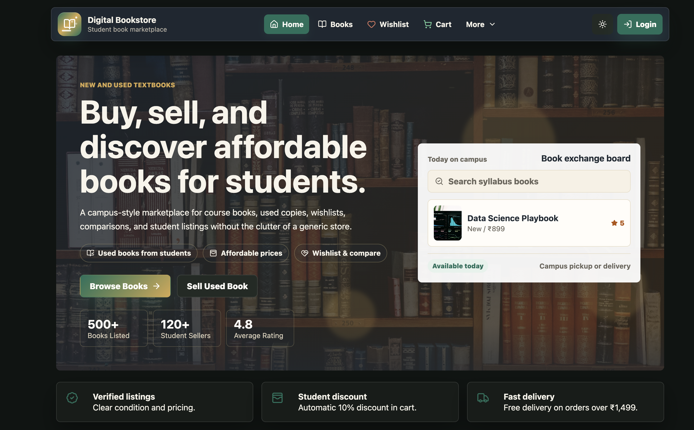
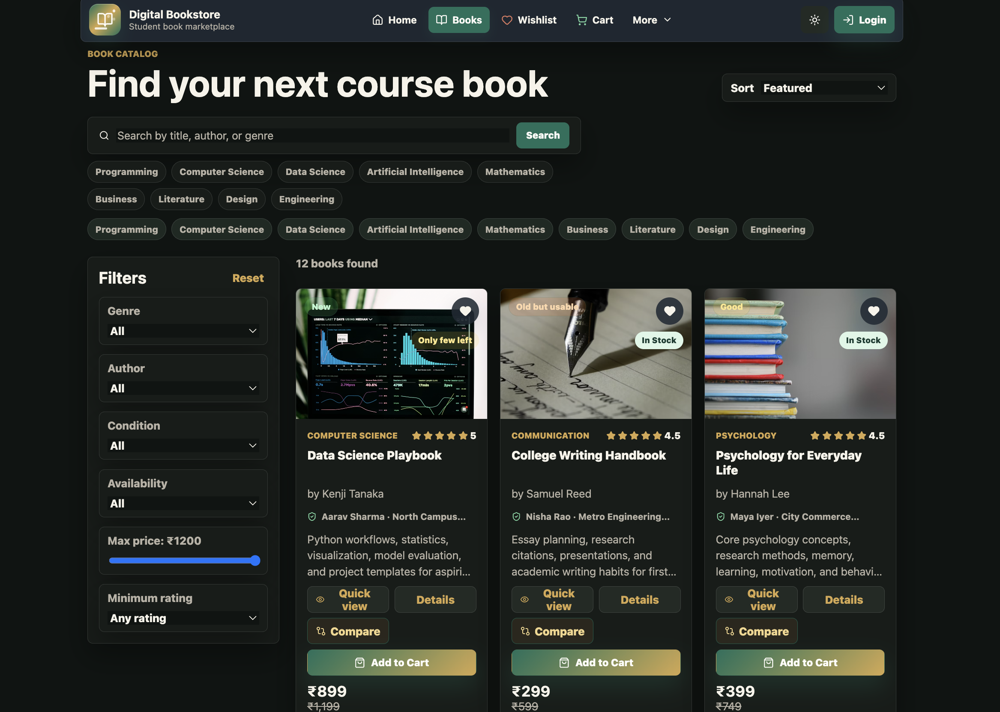
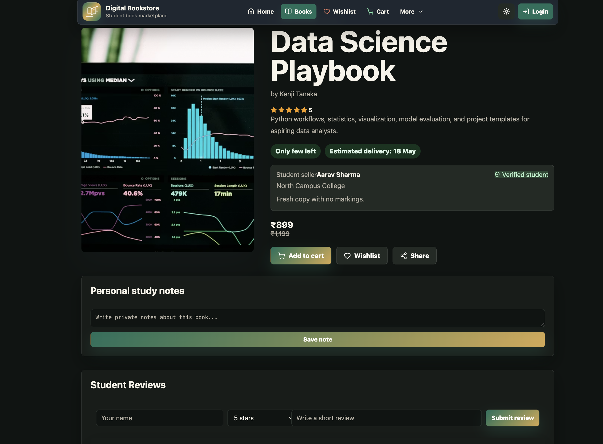
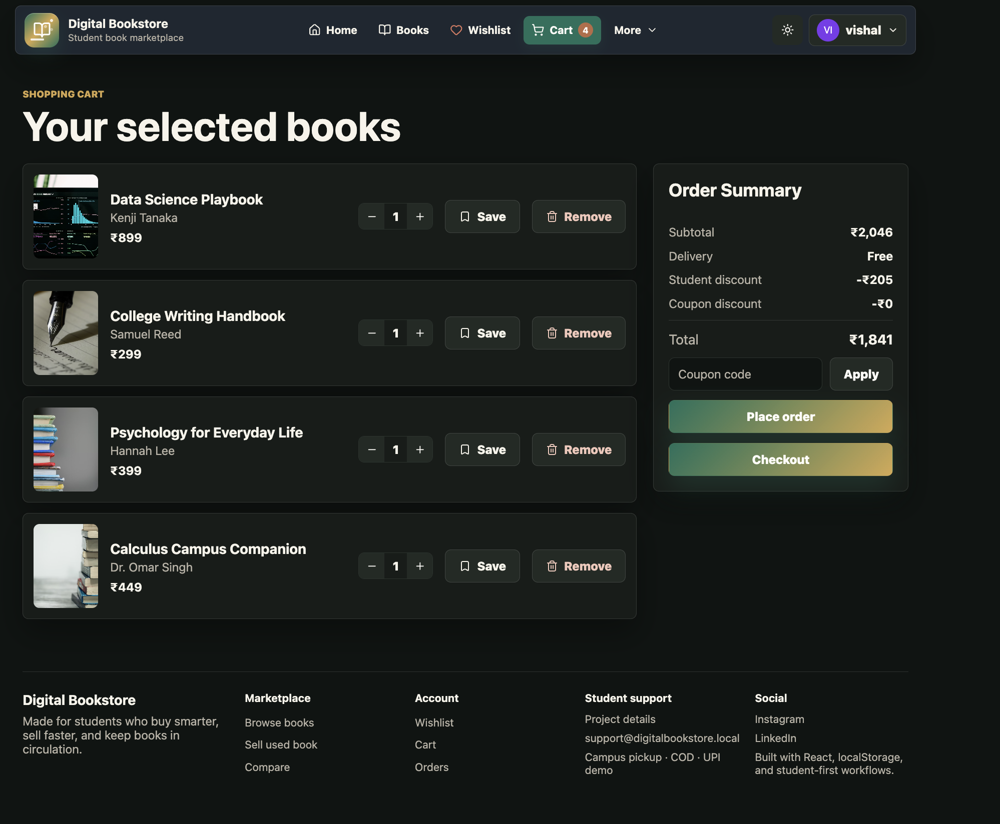
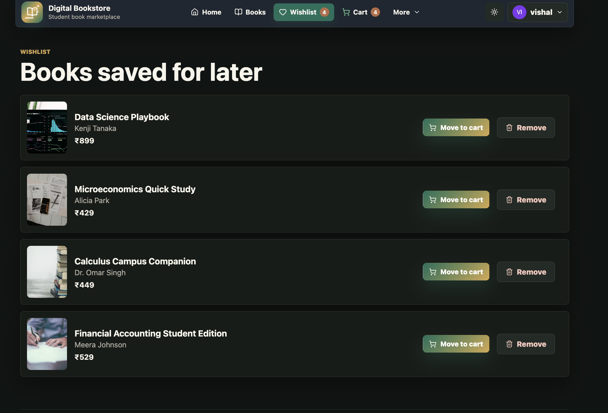
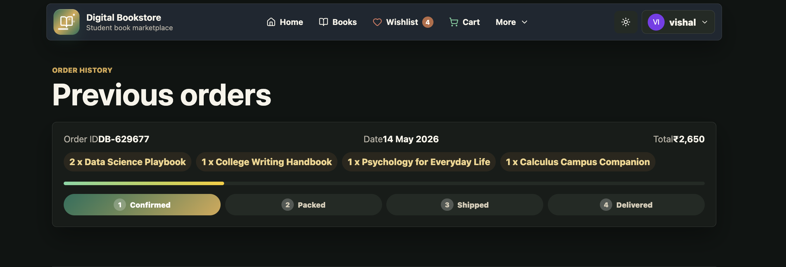
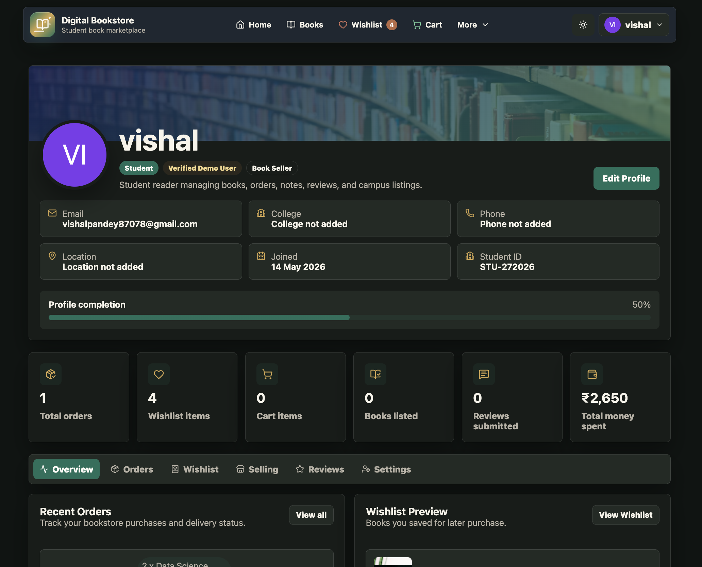
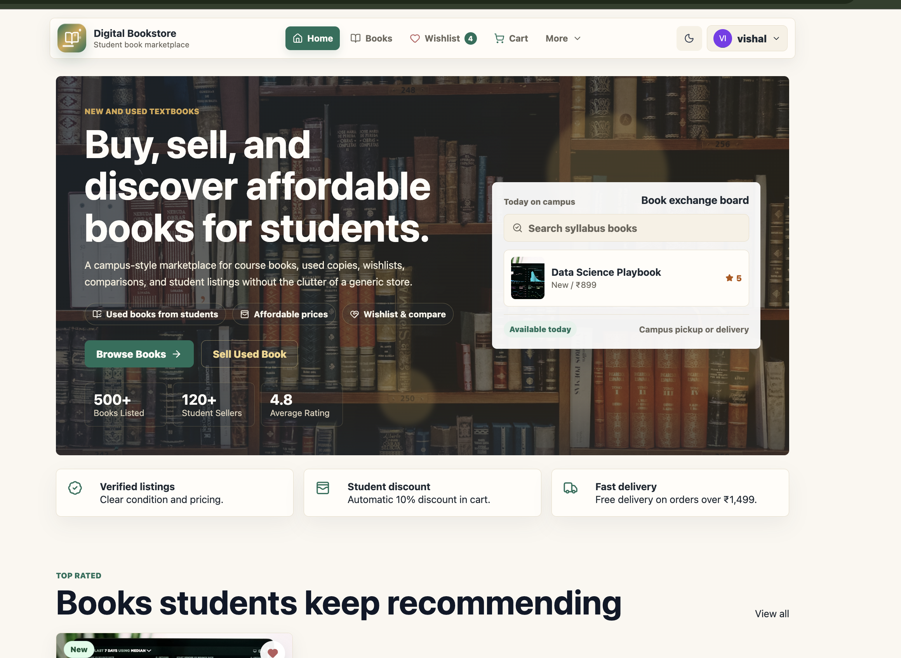

# Digital Bookstore

> A student book marketplace for buying, selling, wishlisting, comparing, and managing new or used books.


Digital Bookstore is a React JS and Vite based online book marketplace designed for students. It helps students browse academic and general books, search by subject or author, compare options, manage a wishlist, add books to cart, place demo orders, and list used books for sale.

The project uses the Open Library API to fetch real book data and combines it with local demo marketplace data such as price, condition, seller details, stock, reviews, and ratings. Most user actions are stored in `localStorage`, making the app work like a complete frontend e-commerce prototype without requiring a backend.

## Table of Contents

- [Project Overview](#project-overview)
- [Problem Statement](#problem-statement)
- [Objectives](#objectives)
- [Key Features](#key-features)
- [Extra Features](#extra-features)
- [Tech Stack](#tech-stack)
- [API Used](#api-used)
- [Project Architecture](#project-architecture)
- [Folder Structure](#folder-structure)
- [Installation and Setup](#installation-and-setup)
- [Available Scripts](#available-scripts)
- [How to Use the Website](#how-to-use-the-website)
- [Pages Description](#pages-description)
- [Data Storage](#data-storage)
- [React Concepts Used](#react-concepts-used)
- [Screenshots](#screenshots)
- [Challenges Faced](#challenges-faced)
- [Future Enhancements](#future-enhancements)
- [Learning Outcomes](#learning-outcomes)
- [Project Status](#project-status)
- [Author](#author)
- [License](#license)

## Project Overview

Digital Bookstore is a student-focused online book marketplace where students can buy and sell new or used books. It is useful for college students because course books, reference books, competitive exam books, and technical books can be expensive when purchased new every semester.

The website solves this problem by providing one place where students can:

- Find affordable used books.
- Compare books based on price, rating, condition, and availability.
- Save books to wishlist for later.
- Add books to cart and view complete pricing.
- Sell their own used books by creating a marketplace listing.
- Track demo orders and manage profile information.

For a college project, this application demonstrates a practical e-commerce workflow using React, API integration, routing, state management, reusable components, and browser-based data persistence.

## Problem Statement

"Digital Bookstore is an online store where students can browse, search, and manage a collection of new or used books. It provides dynamic product display, search functionality, shopping cart with pricing, order summary and history, book categorization by genre/author, user reviews and ratings, wishlist, and sorting options."

## Objectives

- To create a student-friendly digital bookstore.
- To allow students to buy and sell used books.
- To provide search, filter, and sorting functionality.
- To manage cart, wishlist, orders, and profile.
- To use API-based book data with fallback local data.
- To build a responsive React web application.

## Key Features

| Feature | Description |
| --- | --- |
| Dynamic product display | Displays local demo books and API books in a responsive book grid with title, author, cover, price, rating, condition, and stock details. |
| Open Library API book fetching | Fetches real books from Open Library based on default and user-entered search terms. |
| Local demo books fallback | Uses local book data when API data is unavailable or when demo marketplace information is needed. |
| Search by title, author, and genre | Allows students to quickly search books using title, author, genre, subject, or publication-related terms. |
| Category and subject chips | Provides quick search chips such as Programming, Computer Science, Data Science, AI, Mathematics, Business, Literature, Design, and Engineering. |
| Advanced filters | Filters books by genre, author, condition, availability, maximum price, and minimum rating. |
| Sorting options | Sorts books by featured order, price low to high, price high to low, rating, and newest books. |
| Shopping cart | Supports adding books to cart, changing quantity, removing items, saving for later, and viewing complete price calculation. |
| Wishlist | Lets users save books for later and move wishlist items to the cart. |
| Compare books | Allows comparison of up to three books based on important marketplace details. |
| Book details page | Shows detailed book information, seller details, reviews, condition notes, and related actions. |
| Quick view modal | Provides a faster way to preview book details without leaving the listing page. |
| User reviews and ratings | Supports demo review submission and updates the displayed average rating. |
| Sell used book form | Allows students to list their used books with book details, price, condition, and contact information. |
| Order summary | Shows subtotal, discount, delivery charge, coupon discount, and final total. |
| Order history | Stores placed orders locally and displays previous order information. |
| Order tracking/status | Shows order progress using demo status steps such as Confirmed, Packed, Shipped, and Delivered. |
| Profile section | Manages student profile, orders, wishlist, listed books, reviews, settings, and account information. |
| Login/signup demo authentication | Provides frontend-only demo login and signup using localStorage. |
| Admin dashboard demo | Includes a demo admin area for managing locally listed books and marketplace data. |
| Dark mode | Supports light and dark themes with saved theme preference. |
| Responsive design | Works across desktop, tablet, and mobile screen sizes. |
| Toast notifications | Displays short feedback messages for actions such as cart updates, wishlist updates, login, and orders. |
| LocalStorage persistence | Saves cart, wishlist, orders, profile, listings, reviews, theme, comparison list, and session data in the browser. |

## Extra Features

- Coupon system with demo coupon codes such as `STUDENT10`, `BOOK50`, and `FREESHIP`.
- Recently viewed books for quick access to previously opened book details.
- Seller information with student seller name, college, and verification status.
- Stock availability labels such as In Stock, Only few left, and Out of Stock.
- Presentation mode for hiding technical API error messages during project demos.
- API timeout handling to prevent long loading states.
- Cached API results in localStorage for faster repeated searches.
- Secondary Google Books fallback in the API service if Open Library fails.
- Book request page for students who want to request unavailable books.
- Save for later option in the cart.

## Tech Stack

| Category | Technology |
| --- | --- |
| Frontend | React JS |
| Build Tool | Vite |
| Language | JavaScript |
| Styling | CSS, shadcn/ui-style components |
| Routing | React Router DOM |
| Icons | lucide-react |
| Animations | ReactBits components, CSS animations |
| Data Storage | localStorage |
| API | Open Library API |
| Fallback API | Google Books API fallback |

## API Used

The project uses the Open Library API to fetch real book data. Open Library provides catalog information such as title, author, subject, publish year, ISBN, and cover IDs.

Example search endpoint:

```text
https://openlibrary.org/search.json?q=programming
```

Example cover image endpoint:

```text
https://covers.openlibrary.org/b/id/COVER_ID-M.jpg
```

Since Open Library is a book catalog and not an e-commerce API, the following marketplace fields are generated or managed locally for demo purposes:

- Price
- Original price
- Book condition
- Stock quantity
- Availability status
- Seller information
- Ratings and reviews
- Sold count
- Cart and order details

API handling in this project includes:

- Request timeout handling.
- Search by user-entered term or subject chip.
- Normalization of API books into a marketplace-friendly format.
- Local cache for recently fetched API results.
- Local demo books as fallback display data.
- Google Books fallback in the service layer if Open Library is unavailable.

## Project Architecture

Digital Bookstore follows a simple frontend architecture suitable for a college mini project:

- `App.jsx` defines application routes and common layout.
- `pages/` contains route-level screens such as Home, Books, Cart, Orders, Profile, Sell Book, and Admin.
- `components/` contains reusable UI components such as Navbar, BookCard, SearchBar, FilterSidebar, PriceSummary, and QuickViewDialog.
- `context/StoreContext.jsx` works as the main state management layer for cart, wishlist, orders, profile, theme, reviews, comparison list, and authentication.
- `services/booksApi.js` manages API calls, timeouts, fallback API handling, and normalization of external book data.
- `data/booksData.js` stores local demo books used as fallback and initial marketplace content.
- `localStorage` is used as a lightweight browser database for demo persistence.

This structure keeps the project beginner-friendly while still showing real-world React patterns such as reusable components, context-based global state, API services, routing, and persistent UI state.

## Folder Structure

```text
src/
|-- assets/
|-- components/
|   |-- Navbar.jsx
|   |-- BookCard.jsx
|   |-- SearchBar.jsx
|   |-- FilterSidebar.jsx
|   |-- SortDropdown.jsx
|   |-- QuickViewDialog.jsx
|   |-- ReviewSection.jsx
|   |-- PriceSummary.jsx
|   |-- Footer.jsx
|   `-- ...
|-- components/profile/
|   |-- ProfileHeader.jsx
|   |-- ProfileOrders.jsx
|   |-- ProfileWishlist.jsx
|   |-- ProfileSelling.jsx
|   |-- ProfileReviews.jsx
|   |-- ProfileSettings.jsx
|   `-- ...
|-- components/reactbits/
|   |-- AnimatedEmptyState.jsx
|   |-- AnimatedNumber.jsx
|   |-- MagneticButton.jsx
|   |-- ReactBitsBackground.jsx
|   `-- ...
|-- components/ui/
|   |-- button.jsx
|   |-- card.jsx
|   |-- dialog.jsx
|   |-- input.jsx
|   |-- tabs.jsx
|   `-- ...
|-- context/
|   `-- StoreContext.jsx
|-- data/
|   `-- booksData.js
|-- pages/
|   |-- Home.jsx
|   |-- Books.jsx
|   |-- BookDetails.jsx
|   |-- Cart.jsx
|   |-- Checkout.jsx
|   |-- Wishlist.jsx
|   |-- Orders.jsx
|   |-- Compare.jsx
|   |-- SellBook.jsx
|   |-- BookRequest.jsx
|   |-- Admin.jsx
|   |-- Profile.jsx
|   |-- Login.jsx
|   |-- Signup.jsx
|   `-- About.jsx
|-- services/
|   `-- booksApi.js
|-- utils/
|   `-- formatCurrency.js
|-- App.jsx
|-- main.jsx
`-- styles.css
```

## Installation and Setup

Follow these steps to run the project locally.

### Prerequisites

Make sure the following tools are installed:

- Node.js
- npm
- Git

### Steps

1. Clone the repository.

```bash
git clone YOUR_REPOSITORY_LINK
```

2. Open the project folder.

```bash
cd digital-bookstore
```

3. Install dependencies.

```bash
npm install
```

4. Start the development server.

```bash
npm run dev
```

5. Open the website in your browser.

```text
http://localhost:5173
```

> Note: The development server may use another port if `5173` is already busy. Check the terminal output after running `npm run dev`.

## Available Scripts

| Script | Description |
| --- | --- |
| `npm run dev` | Starts the Vite development server. |
| `npm run build` | Creates a production-ready build of the project. |
| `npm run preview` | Previews the production build locally. |

## How to Use the Website

1. Open the home page and explore the marketplace sections.
2. Go to the Books page to browse available books.
3. Search books by title, author, genre, or subject.
4. Use filters to narrow results by genre, author, condition, availability, price, and rating.
5. Sort books by price, rating, or newest results.
6. Open a book details page to view full information.
7. Add books to cart or wishlist.
8. Compare up to three books before buying.
9. Use the cart page to update quantity, apply coupon, and check pricing.
10. Place a demo order from checkout.
11. View order history and tracking status from the Orders page.
12. List a used book from the Sell page.
13. Edit profile details from the Profile page.
14. Toggle dark mode from the navigation/profile controls.

## Pages Description

| Page | Description |
| --- | --- |
| Home Page | Landing page for the bookstore with featured marketplace sections and quick navigation. |
| Books Page | Main catalog page with API books, local books, search, filters, sorting, and subject chips. |
| Book Details Page | Detailed view of a selected book with seller details, reviews, actions, and related information. |
| Cart Page | Displays selected books, quantity controls, save for later, coupon, and price summary. |
| Checkout Page | Collects demo checkout details and places an order. |
| Wishlist Page | Shows saved books and allows moving items to cart. |
| Compare Page | Compares selected books based on price, rating, condition, stock, and other details. |
| Sell Page | Allows students to list used books for sale. |
| Book Request Page | Allows students to request books that are not currently listed. |
| Orders Page | Shows order history and demo order tracking status. |
| Profile Page | Displays user profile, orders, wishlist, selling activity, reviews, and settings. |
| Admin Page | Demo admin dashboard for managing marketplace book data. |
| About Page | Provides project and platform information. |
| Login/Signup Page | Demo authentication pages for creating and accessing a local account. |

## Data Storage

This project uses `localStorage` for frontend persistence. Data remains saved in the same browser until localStorage is cleared.

| Data | Purpose |
| --- | --- |
| Cart | Stores selected books and quantities. |
| Wishlist | Stores books saved for later. |
| Orders | Stores placed demo orders. |
| User profile | Stores profile details such as name, email, college, phone, and location. |
| Listed books | Stores used books added by students through the sell form. |
| Recently viewed books | Stores recently opened book details. |
| Theme | Stores light or dark mode preference. |
| API cache | Stores recently fetched book results for faster loading. |
| Login session | Stores the currently logged-in demo user. |
| Reviews | Stores locally submitted reviews. |
| Compare list | Stores books selected for comparison. |
| Book requests | Stores requested book details. |

## React Concepts Used

- Components for reusable UI sections.
- Props for passing data between components.
- `useState` for local component state.
- `useEffect` for API fetching, theme updates, and lifecycle behavior.
- `useMemo` for derived data such as filtered books, pricing, and sorted lists.
- Context API for shared store management.
- React Router for page navigation.
- Conditional rendering for loading, empty states, protected pages, and UI feedback.
- Lists and keys for rendering book grids, cart items, orders, and reviews.
- Form handling for login, signup, checkout, profile update, reviews, and sell book forms.
- localStorage for browser-based persistence.
- API fetching with error and timeout handling.
- Basic protected routes for pages that require demo login.

## Screenshots

Add project screenshots inside a `screenshots/` folder using the file names below.

### Home Page



### Books Page



### Book Details Page



### Cart Page



### Wishlist Page



### Compare Page


### Orders Page



### Profile Page



### Light Mode



## Challenges Faced

- Managing cart and wishlist state across multiple pages.
- Preventing duplicate cart and wishlist items.
- Handling API slow loading and timeout cases.
- Creating fallback data when external API results are not available.
- Making filters work correctly with both API books and local demo books.
- Keeping dark mode readable across all UI sections.
- Maintaining responsive layouts for book grids, filters, cart, and profile screens.
- Creating realistic e-commerce data from a catalog-based API.
- Persisting user actions in localStorage without a backend.

## Future Enhancements

- Backend with Node.js and Express.
- MongoDB or Firebase database.
- Real authentication and password security.
- Real payment gateway integration.
- Real seller dashboard.
- Book delivery tracking with live updates.
- Chat between buyer and seller.
- AI-based book recommendations.
- College-wise book marketplace.
- Admin analytics and reporting.
- Image upload for used book listings.
- Email notifications for orders and book requests.

## Learning Outcomes

Through this project, I learned how to:

- Structure a React project using reusable components.
- Manage state using hooks and Context API.
- Integrate external APIs in a React application.
- Normalize API data for frontend use.
- Store and retrieve data using localStorage.
- Build cart, wishlist, order, and profile workflows.
- Implement search, filtering, sorting, and comparison features.
- Handle forms and validation in React.
- Create responsive layouts for different screen sizes.
- Debug UI issues, API errors, and state management problems.
- Build a real-world e-commerce style application as a college project.

## Project Status

This project is currently under development / completed as a college mini project.

## Author

| Field | Details |
| --- | --- |
| Name | Vishal Pandey |
| Role | B.Tech CSE |
| GitHub | YOUR_GITHUB_LINK |
| LinkedIn | https://www.linkedin.com/in/vishal-pandey-5b897a378/ |

## License

This project is created for educational purposes.
